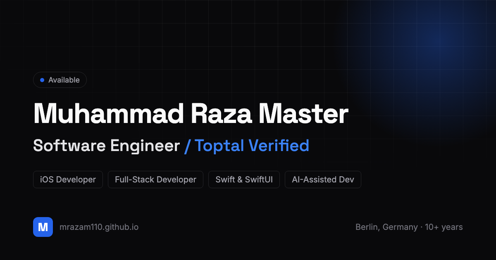

# Developer Portfolio

A clean, fast, open-source developer portfolio. Built with Next.js, TypeScript,
and Tailwind, exported as a static site, and hosted free on GitHub Pages. You
make it yours by editing two files. No build tooling to learn, no backend.

**Live:** https://mrazam110.github.io



## Why use this

- Your content lives in two typed files. You never touch component code.
- Dark first, with a light toggle and one accent color you change in one line.
- Sections you can switch on or off: about, skills, experience, projects,
  education, certifications, contact.
- Animations that stay out of the way and respect reduced-motion.
- Accessible by default: AA contrast, keyboard focus, labeled controls.
- Good SEO and social cards (Open Graph image, metadata) with no setup.
- Free hosting on GitHub Pages through a ready-made GitHub Actions workflow.

## Quick start

```bash
# 1. Fork this repo (button top-right on GitHub), then clone your fork
git clone https://github.com/<your-username>/<your-repo>.git
cd <your-repo>

# 2. Install and run locally
npm install
npm run dev          # open http://localhost:3000

# 3. Edit two files (see below), then push. It deploys itself.
```

For a personal site at `https://<your-username>.github.io`, name your repo
exactly `<your-username>.github.io`. Any other name gives a project site at
`https://<your-username>.github.io/<repo>`, which also works with no changes.

## The two files you edit

Everything personal lives here. The rest is the engine.

### 1. `config/site.config.ts` (who you are and how it looks)

```ts
name: 'Your Name',
logoText: 'You',            // short text for the nav logo
role: 'Software Engineer',
tagline: 'One line about you.',
email: 'you@example.com',
url: 'https://you.github.io',
resumePath: '/cv.pdf',      // file in /public, or '' to hide the button

accentRGB: '37 99 235',     // brand color as "R G B" (light mode)
accentRGBDark: '59 130 246',// brand color in dark mode

heroRotatingWords: ['iOS Developer', 'Full-Stack Developer'],

socials: [ /* github, linkedin, etc. */ ],

sections: { about: true, skills: true, /* ... set any to false */ },
```

### 2. `data/portfolio.ts` (your content)

About text, skills, experience, projects, education, certifications. The types
guide you as you type. To add an experience, copy an existing block in the
`experience` array and change the values.

### What you do not touch

`app/`, `components/`, `next.config.js`, `tailwind.config.ts`, and the deploy
workflow. They are the engine and they stay the same.

## Customizing

**Change the accent color.** One line in `config/site.config.ts`:

```ts
accentRGB: '37 99 235',   // blue (default)
accentRGB: '5 150 105',   // emerald
accentRGB: '124 58 237',  // violet
```

**Hide a section.** Set its toggle to `false`. The section and its nav link
disappear, no code deleted:

```ts
sections: { certifications: false }
```

**Swap the assets.** Replace these in `public/`: `cv.pdf` (your resume),
`og-image.png` (social preview, 1200x630), `favicon.svg`.

## Deploy to GitHub Pages

1. Push to your repo's default branch.
2. In your repo, open **Settings, then Pages**, and set **Source** to
   **GitHub Actions** (one time).
3. The included workflow builds and publishes on every push. Your site is live
   at `https://<your-username>.github.io`.

## Built with Claude Code

This portfolio was built with [Claude Code](https://claude.com/claude-code).
Two skills are bundled in `.claude/skills` so anyone who opens the repo in
Claude Code can use them right away, with nothing to install:

- **humanizer** removes AI writing patterns from your copy. Open the repo in
  Claude Code and run `/humanizer` on your about text or project descriptions
  before you publish. House rule it enforces here: no em dashes.
- **ui-ux-pro-max** is a design assistant. Ask Claude for UI help (for example
  "improve the projects section spacing") and it applies a real design system:
  style, color, typography, and the anti-patterns to avoid. The design here was
  shaped by it. The full spec lives in `DESIGN_SYSTEM.md`.

You do not need Claude Code to use this template. The site is a normal Next.js
app. The skills are a bonus for anyone who wants AI help while customizing.

## Credits

- Inspired by [developerFolio](https://github.com/saadpasta/developerFolio) by
  Saad Pasta.
- Inspired by [Brittany Chiang's v4](https://github.com/bchiang7/v4).
- Design intelligence from the
  [ui-ux-pro-max](https://github.com/nextlevelbuilder/ui-ux-pro-max-skill)
  skill by nextlevelbuilder.
- Copy kept human with the [humanizer](https://github.com/blader/humanizer)
  skill by blader.

Both bundled skills are MIT licensed and credited in
`.claude/skills/CREDITS.md`.

## Tech

Next.js 15 (App Router), React 19, TypeScript, Tailwind CSS, framer-motion,
next-themes, Lucide icons.

## License

MIT. See `LICENSE`. Use it freely. A link back is appreciated but not required.
